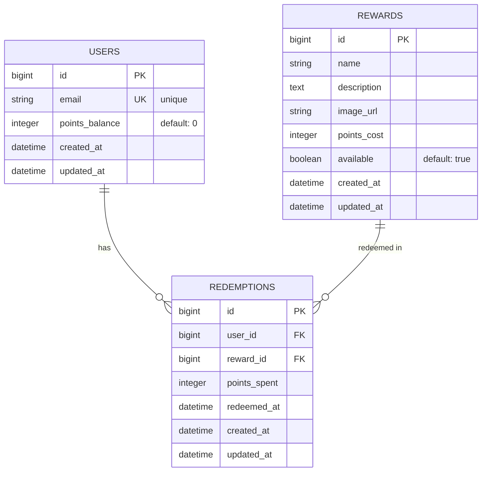

# Architecture

Technical architecture, design decisions, and implementation details for the
Rewards Redemption App.

## Tech Stack

| Layer          | Technology                                |
| -------------- | ----------------------------------------- |
| Frontend       | React, TypeScript, Redux, Vite            |
| Backend        | Ruby on Rails 8 API                       |
| Infrastructure | Docker, AWS ECS/Fargate                   |
| CI/CD          | GitHub Actions                            |
| Quality        | Mise, Pre-commit, Markdownlint, RuboCop   |
|                | ESLint, Prettier, Hadolint                |
| Observability  | Sentry                                    |
| Testing        | Minitest (Rails), Vitest (React)          |

## Architectural Decisions

### Monorepo Structure

Single repository with `api/` and `web/` directories. Enables atomic commits
across stack, shared CI/CD, and simpler dependency management for a small team.

```text
rewards-app/
├── README.md                     # Architecture + shipping plan
├── .gitignore
├── .mise.toml                    # Tool version management
├── .pre-commit-config.yaml       # Git hooks
├── .markdownlint.json            # Markdown linting rules
├── docker-compose.yml
├── .github/
│   └── workflows/
│       ├── ci.yml
│       └── deploy.yml
├── api/                          # Rails API
│   ├── Dockerfile
│   ├── .rubocop.yml
│   ├── app/
│   │   ├── controllers/api/v1/
│   │   ├── models/
│   │   ├── services/
│   │   └── serializers/
│   └── test/
└── web/                          # React Frontend
    ├── Dockerfile
    ├── nginx.conf
    ├── .eslintrc.json
    ├── .prettierrc
    ├── src/
    │   ├── components/
    │   ├── hooks/
    │   ├── store/
    │   └── services/
    └── vite.config.ts
```

### Backend: Ruby on Rails 8 API

- **API-only mode:** JSON responses, no view layer
- **Service objects:** Business logic extracted from controllers
- **Minitest:** Rails default test framework
- **RuboCop:** Ruby style enforcement with Rails cops

### Frontend: React + TypeScript + Vite

- **TypeScript:** Type safety, compile-time error checking
- **Vite:** Fast dev server with native ES modules
- **Redux Toolkit:** Predictable state management
- **ESLint + Prettier:** Code quality and formatting
- **Vitest:** Fast unit testing with Vite integration

### Infrastructure: Docker + PostgreSQL

- **Docker Compose:** Consistent dev environment, mirrors production
- **PostgreSQL:** Production-grade database
- **Multi-stage builds:** Smaller production images, cached layers
- **Hadolint:** Dockerfile linting for best practices

### CI/CD: GitHub Actions + AWS

- **GitHub Actions:** CI pipeline with linting and tests
- **AWS ECS/Fargate:** Serverless container deployment with auto-scaling

### Quality: Mise + Pre-commit + Linters + Tests

- **Mise:** Polyglot tool version manager
- **Pre-commit hooks:** Catch issues before commit
- **Markdownlint:** Markdown style enforcement
- **RuboCop:** Ruby style enforcement (with Rails)
- **ESLint:** TypeScript/React style enforcement (with React)
- **Prettier:** Code formatting (with React)
- **Hadolint:** Dockerfile best practices (with Dockerfiles)
- **Minitest + Vitest:** Unit and integration tests

### Observability: Sentry

- **Error tracking:** Capture exceptions with context
- **Source maps:** Readable stack traces for frontend errors

## Shipping Plan

### Phase 1: Foundation (Complete)

- [x] #1 Initial Setup
  - Monorepo structure (api/, web/, terraform/, docs/)
  - Rails 8 API with RuboCop, Minitest, Sentry
  - React + TypeScript + Vite with ESLint, Prettier, Vitest, Sentry
  - Docker Compose + PostgreSQL
  - Terraform modules (VPC, ECR, RDS, ECS)
  - GitHub Actions CI/CD
  - Pre-commit hooks for all file types

### Phase 2: Features (Vertical Slices)

- [ ] #2 User Points Balance
- [ ] #3 Browse Available Rewards
- [ ] #4 Redeem a Reward
- [ ] #5 Redemption History
- [ ] #6 Documentation

## Design Decisions & Trade-offs

### Quality Gates Integrated from Day One

Linters and formatters are added alongside their respective frameworks rather
than as a separate phase. This ensures code quality from the first line of
production code.

### CI/CD Pipeline in Foundation

Deploy pipeline is built in the foundation phase to enable continuous delivery
from the start. This allows iterative feature deployment and real-world testing
early.

### Observability Early

Sentry integration in the foundation ensures error tracking is available from
the first deployed code, providing visibility into production issues immediately.

### Pre-commit in Monorepo Root

Markdownlint is configured at the monorepo root level. Framework-specific
linters (RuboCop, ESLint, Prettier, Hadolint) are configured in their
respective directories.

---

## Database Schema

### Entity Relationship Diagram



### Tables

#### users

Stores user accounts with their points balance.

| Column        | Type    | Constraints         | Notes                          |
| ------------- | ------- | ------------------- | ------------------------------ |
| id            | bigint  | PK, auto-increment  |                                |
| email         | string  | NOT NULL, UNIQUE    | User email address             |
| points_balance| integer | NOT NULL, def: 0    | Available points for redemption|
| created_at    | datetime| NOT NULL            |                                |
| updated_at    | datetime| NOT NULL            |                                |

**Indexes:**

- `index_users_on_email` (UNIQUE) - Fast lookup by email

#### rewards

Catalog of rewards users can redeem.

| Column      | Type     | Constraints         | Notes                            |
| ----------- | -------- | ------------------- | -------------------------------- |
| id          | bigint   | PK, auto-increment  |                                  |
| name        | string   | NOT NULL            | Reward name                      |
| description | text     |                     | Detailed description             |
| image_url   | string   |                     | Image URL (Unsplash)             |
| points_cost | integer  | NOT NULL            | Points required to redeem        |
| available   | bool     | NOT NULL, def: true | Whether available for redemption |
| created_at  | datetime | NOT NULL            |                                  |
| updated_at  | datetime | NOT NULL            |                                  |

**Indexes:**

- `index_rewards_on_available_and_points_cost` - Filter by availability and sort by cost

#### redemptions

Audit log of reward redemptions with points spent.

| Column      | Type    | Constraints           | Notes                           |
| ----------- | ------- | --------------------- | ------------------------------- |
| id          | bigint  | PK, auto-increment    |                                 |
| user_id     | bigint  | NOT NULL, FK users    | Who redeemed                    |
| reward_id   | bigint  | NOT NULL, FK rewards  | What was redeemed               |
| points_spent| integer | NOT NULL              | Points deducted at redemption   |
| redeemed_at | datetime| NOT NULL              | When redemption occurred        |
| created_at  | datetime| NOT NULL              |                                 |
| updated_at  | datetime| NOT NULL              |                                 |

**Indexes:**

- `index_redemptions_on_user_id` - Find all redemptions by user
- `index_redemptions_on_reward_id` - Find redemptions of specific reward
- `index_redemptions_on_user_id_and_redeemed_at` - Efficient history pagination

---

## Backend Architecture

### Service Objects Pattern

Business logic is extracted from controllers into service objects for testability,
reusability, and transaction management.

#### Example: RedemptionService

Located: `api/app/services/redemption_service.rb`

```ruby
class RedemptionService
  class InsufficientPointsError < StandardError; end
  class RewardUnavailableError < StandardError; end

  def self.redeem(user_id:, reward_id:)
    new(user_id:, reward_id:).redeem
  end

  def initialize(user_id:, reward_id:)
    @user_id = user_id
    @reward_id = reward_id
  end

  def redeem
    ActiveRecord::Base.transaction do
      user = User.lock.find(@user_id)  # Pessimistic lock
      reward = Reward.find(@reward_id)

      raise RewardUnavailableError unless reward.available
      raise InsufficientPointsError if user.points_balance < reward.points_cost

      user.update!(points_balance: user.points_balance - reward.points_cost)
      Redemption.create!(
        user:,
        reward:,
        points_spent: reward.points_cost,
        redeemed_at: Time.current
      )
    end
  end
end
```

**Benefits:**

- Single responsibility: Encapsulates redemption business logic
- Testable: Can test service independently from controller logic
- Transactional: Uses `ActiveRecord::Base.transaction` for ACID guarantees
- Reusable: Can call service from multiple controllers or background jobs

### Pessimistic Locking

Race condition prevention using database-level row locks.

When two requests try to redeem simultaneously:

1. First request: `User.lock.find(@user_id)` acquires exclusive lock
2. Second request: Blocked waiting for lock
3. First request: Completes redemption, releases lock
4. Second request: Acquires lock, validates, proceeds

**Why:** Prevents money-like issues where two users could redeem with insufficient balance.

### Serialization with Alba

Alba serializers convert Rails models to JSON without view rendering.

Located: `api/app/serializers/`

Controllers use serializers for consistent, documented responses:

```ruby
class Api::V1::RewardsController < ApplicationController
  def index
    rewards = Reward.where(available: true)
    render json: RewardResource.new(rewards).serialize
  end
end
```

---

## Frontend Architecture

### Component Hierarchy

```text
App
├── ErrorBoundary
├── Navigation
│   ├── Logo
│   └── UserBalance
│       └── (displays user.points_balance from Redux)
└── main (Routes)
    ├── Route: "/" → RewardsList
    │   ├── RewardCard (for each reward)
    │   │   ├── Image
    │   │   ├── Name & Description
    │   │   ├── Cost Badge
    │   │   └── Redeem Button
    │   └── Loading / Error states
    │
    └── Route: "/redemptions" → RedemptionHistory
        ├── HistoryTable
        │   └── HistoryRow (for each redemption)
        │       ├── Reward Name
        │       ├── Points Spent
        │       └── Redeemed Date
        └── Loading / Error states
```

### State Management (Redux Toolkit)

Redux with 4 slices for complete app state:

**1. userSlice** (`src/store/userSlice.ts`)

- Current user data (id, email, points_balance)
- Fetches from `/api/v1/users/me`
- Async thunk: `fetchUser`

**2. rewardsSlice** (`src/store/rewardsSlice.ts`)

- Available rewards list
- Fetches from `/api/v1/rewards`
- Async thunk: `fetchRewards`

**3. redemptionSlice** (`src/store/redemptionSlice.ts`)

- Pending redemption request state
- Tracks loading, error, success
- Async thunk: `redeemReward` (POST to `/api/v1/redemptions`)

**4. redemptionHistorySlice** (`src/store/redemptionHistorySlice.ts`)

- User's past redemptions
- Fetches from `/api/v1/redemptions`
- Async thunk: `fetchRedemptionHistory`

**Store hooks:** `src/store/hooks.ts`

- `useAppDispatch` - typed dispatch
- `useAppSelector` - typed selector

### Custom Hooks Pattern

Encapsulate Redux logic and API calls for component reuse.

**useRewards** (`src/hooks/useRewards.ts`)

```tsx
export function useRewards() {
  const dispatch = useAppDispatch();
  const { items, loading, error } = useAppSelector(state => state.rewards);

  useEffect(() => {
    dispatch(fetchRewards());
  }, [dispatch]);

  return { rewards: items, loading, error };
}
```

**useRedemptionHistory** (`src/hooks/useRedemptionHistory.ts`)

```tsx
export function useRedemptionHistory() {
  const dispatch = useAppDispatch();
  const { items, loading, error } = useAppSelector(state => state.redemptionHistory);

  useEffect(() => {
    dispatch(fetchRedemptionHistory());
  }, [dispatch]);

  return { history: items, loading, error };
}
```

Components use hooks instead of Redux directly:

```tsx
function RewardsList() {
  const { rewards, loading, error } = useRewards();
  // ...
}
```

### Theme System (CSS Custom Properties)

Located: `src/styles/theme.css`

CSS custom properties for consistent, maintainable theming:

```css
:root {
  /* Brand Colors */
  --color-brand-primary: #11c0bf;
  --color-brand-dark: #2c5f5f;
  --color-brand-light: #e0f7f6;

  /* Typography */
  --font-family-primary: -apple-system, BlinkMacSystemFont, "Segoe UI", Roboto;
  --font-size-base: 16px;
  --font-weight-medium: 500;

  /* Spacing */
  --spacing-md: 16px;
  --spacing-lg: 24px;

  /* Effects */
  --radius-md: 8px;
  --shadow-md: 0 4px 6px -1px rgba(0, 0, 0, 0.1);
  --transition-base: 250ms ease-in-out;
}
```

CSS Modules scope styles to prevent collisions:

```css
/* RewardCard.module.css */
.card {
  background: var(--color-bg-secondary);
  padding: var(--spacing-md);
  border-radius: var(--radius-md);
  box-shadow: var(--shadow-md);
  transition: transform var(--transition-base);
}

.card:hover {
  transform: translateY(-2px);
}
```

Components import styles as JS objects:

```tsx
import styles from "./RewardCard.module.css";

export function RewardCard({ reward }: Props) {
  return <div className={styles.card}>...</div>;
}
```

### Error Handling

**Error Boundary** (`src/components/ErrorBoundary.tsx`)

- Catches unhandled React component errors
- Displays fallback UI
- Logs to Sentry with context

#### API Error Handling

- Async thunks catch network/validation errors
- Redux slice stores error message
- Components conditionally render error UI

---

## Testing Strategy

### Backend Testing (Minitest)

Located: `api/test/`

Rails default testing framework with integration tests:

```ruby
class Api::V1::RewardsControllerTest < ActionDispatch::IntegrationTest
  test "should list available rewards" do
    reward = Reward.create!(name: "Coffee", points_cost: 100, available: true)
    get api_v1_rewards_url

    assert_response :success
    body = JSON.parse(response.body)
    assert_equal 1, body.length
  end
end
```

**Service tests** validate business logic:

```ruby
class RedemptionServiceTest < ActiveSupport::TestCase
  test "raises error if insufficient points" do
    user = User.create!(points_balance: 50)
    reward = Reward.create!(points_cost: 100, available: true)

    assert_raises(RedemptionService::InsufficientPointsError) do
      RedemptionService.redeem(user_id: user.id, reward_id: reward.id)
    end
  end
end
```

### Frontend Testing (Vitest + React Testing Library)

Located: `web/src/**/*.test.tsx`

Unit tests with RTL for user-centric testing:

```tsx
describe("RewardCard", () => {
  it("displays reward name and cost", () => {
    const reward = { id: 1, name: "Coffee", points_cost: 100 };
    render(<RewardCard reward={reward} onRedeem={vi.fn()} />);

    expect(screen.getByText("Coffee")).toBeInTheDocument();
    expect(screen.getByText("100 points")).toBeInTheDocument();
  });
});
```

**Redux component testing:** Always include complete `preloadedState`:

```tsx
it("loads and displays rewards", async () => {
  const store = configureStore({
    reducer: {
      rewards: rewardsReducer,
      user: userReducer,
    },
    preloadedState: {
      rewards: { items: [], loading: false, error: null, fetched: false },
      user: { user: null, loading: false, error: null },
    },
  });

  render(
    <Provider store={store}>
      <RewardsList />
    </Provider>,
  );

  await waitFor(
    () => expect(screen.getByTestId("rewards")).toBeInTheDocument(),
    { timeout: 2000 },
  );
});
```

---

## Production Deployment

### Infrastructure Overview

The application is fully deployable to AWS for production evaluation:

- **VPC:** Private subnets, public ALB, NAT gateway for outbound traffic
- **RDS PostgreSQL:** Multi-AZ capable, automated backups, parameter encryption
- **ECS Fargate:** Serverless containers, auto-scaling by CPU/memory
- **ALB:** Load balancing, health checks, DNS routing
- **ECR:** Private container registry for Docker images
- **CloudWatch:** Logs, metrics, alarms for monitoring

### CI/CD Pipeline

GitHub Actions workflows handle testing and deployment:

**CI Pipeline** (Pull Requests)

- Validate branch name and commit format
- Run pre-commit hooks (markdownlint, hadolint, prettier)
- Lint and type-check frontend (ESLint, TypeScript)
- Run frontend tests (Vitest)
- Terraform validate

**CD Pipeline** (Push to `deploy` branch)

- Build Docker images (api, web)
- Push to ECR
- Run database migrations
- Update ECS task definitions
- Deploy to Fargate
- Monitor health checks

### Deployment Instructions

See detailed guides:

- [docs/aws-setup.md](docs/aws-setup.md) - Initial infrastructure setup
- [docs/deployment.md](docs/deployment.md) - Deployment process, monitoring
- [terraform/README.md](terraform/README.md) - Terraform module documentation

---

## Implementation Details

### Why Service Objects?

**Chosen vs alternatives:** Service objects vs fat models vs controller logic

**Rationale:**

- Encapsulates redemption business logic in a reusable, testable unit
- Enables clear separation between HTTP concerns and business logic
- Makes transaction handling explicit and composable
- Testable independently from controller routing

**Trade-off:** Adds more files to the codebase, but the clarity and reusability
outweigh this cost as the app scales.

### Why Pessimistic Locking?

**Chosen vs alternatives:** Pessimistic vs optimistic locking vs constraints only

**Rationale:**

- Guarantees money-like accuracy: two concurrent redeems cannot both succeed
with insufficient balance
- Better UX: errors are caught immediately, not on retry
- Simpler to reason about: lock → validate → update → release

**Trade-off:** Slightly slower under extreme concurrency (blocked requests wait),
but provides stronger guarantees and better UX for typical usage.

### Why Redux Toolkit?

**Chosen vs alternatives:** Redux vs Context API vs Zustand vs MobX

**Rationale:**

- Industry standard with excellent DevTools for debugging state changes
- Async thunks provide clean async/await pattern for API calls
- Immer integration prevents accidental mutations
- Strong TypeScript support with typed selectors and hooks

**Trade-off:** More boilerplate than Context API, but prevents subtle bugs at
scale and enables better debugging.

### Why Demo Authentication?

**Chosen vs alternatives:** Demo auth vs JWT vs OAuth vs sessions

**Rationale:**

- Take-home scope: authentication isn't the feature being evaluated
- Simple to test: no login flows, no token management
- Falls back to `User.first` for easy seeding
- Easy to replace with real auth later

**Trade-off:** Not production-ready, but clearly documented as demo-only with
notes on how to implement real auth.

### Why CSS Modules + Custom Properties?

**Chosen vs alternatives:** CSS Modules vs styled-components vs Tailwind vs BEM

**Rationale:**

- Scoped styles prevent class name collisions without runtime overhead
- Custom properties enable consistent theming across components
- No build-time tooling (unlike styled-components)
- TypeScript-safe: styles imported as JS objects prevent typos

**Trade-off:** Separate CSS files require more setup, but pay off in clarity and
performance as component count grows.

### Why Monorepo Structure?

**Chosen vs alternatives:** Monorepo vs separate repos with dependencies

**Rationale:**

- Atomic commits across frontend/backend keep changes synchronized
- Shared CI/CD configuration reduces duplication
- Easier debugging with full stack available locally
- Simpler dependency management for a small team

**Trade-off:** Slightly larger repo, but enables simpler coordination and
unified deployment.

---

## Future Improvements & Known Limitations

### Future Improvements

#### Authentication & Authorization

- Replace demo auth with JWT or OAuth
- Add user roles (admin, user) with RBAC
- Implement refresh token rotation

#### Rewards Management

- Admin UI for CRUD operations on rewards
- Inventory tracking (limited quantity rewards)
- Reward search and filtering
- Reward categories or tags

#### Points System

- Points earning rules (sign up, referral, purchases)
- Points expiration policy
- Points transfer between users
- Points transaction history with reasons

#### User Experience

- In-app notifications for redemptions
- Email confirmations
- Personalized reward recommendations
- Favorite/wishlist rewards
- Email digests

#### Performance

- Redis caching for rewards and user balance
- CDN for image assets
- Pagination on redemption history
- GraphQL API alongside REST (reduce over-fetching)
- Database connection pooling

#### Observability

- APM (Application Performance Monitoring) with detailed traces
- Custom metrics dashboards
- Analytics on redemption patterns
- Alert thresholds for anomalies

#### Testing

- E2E tests (Playwright, Cypress)
- Load testing (k6)
- Visual regression testing
- Accessibility (a11y) testing

#### Infrastructure

- Multi-region deployment for global users
- Database read replicas
- Auto-scaling policies by traffic patterns
- Canary deployments for safer rollouts
- Disaster recovery / backup testing

### Known Limitations

#### Authentication

- Demo auth via X-User-Id header is not production-ready
- No rate limiting on API endpoints (vulnerable to abuse)
- No request signing or HMAC verification

#### Data Handling

- No data deletion/anonymization (GDPR compliance missing)
- No audit logging of who accessed what
- Points balance can only be read, not adjusted by admins

#### API Features

- No pagination on redemption history (could be large)
- No filtering/sorting options on rewards API
- No bulk operations

#### Image Hosting

- Unsplash free tier has rate limits
- Fallback images would help during outages
- Consider self-hosted or S3 storage for production

#### Database

- Single database instance (no read replicas)
- No sharding strategy for horizontal scaling
- No archival of old redemptions

#### Async Processing

- All operations are synchronous (no background jobs)
- No email sending or notifications
- No scheduled tasks (cleanup, reports)

#### Monitoring

- Limited CloudWatch metrics without custom dashboards
- No alerting on business metrics (e.g., unusual redemption patterns)
- Logs only, no centralized tracing (no APM)
